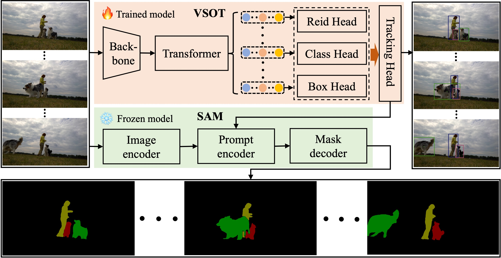
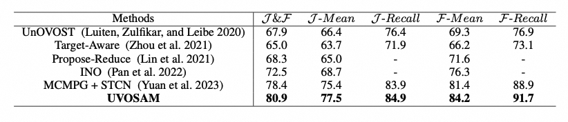
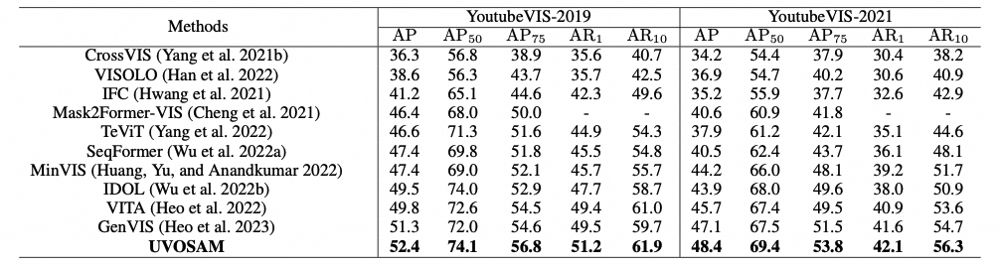

# UVOSAM


[UVOSAM: A Mask-free Paradigm for Unsupervised Video Object Segmentation via Segment Anything Model](https://arxiv.org/abs/2305.12659)

Zhenghao Zhang, Zhichao Wei, Shengfan Zhang, Zuozhuo Dai, Siyu Zhu


### Introduction


Unsupervised video object segmentation has made significant progress in recent years, but the manual annotation of video mask datasets is expensive and limits the diversity of available datasets. The Segment Anything Model (SAM) has introduced a new prompt-driven paradigm for image segmentation, unlocking a range of previously unexplored capabilities. In this paper, we propose a novel paradigm called UVOSAM, which leverages SAM for unsupervised video object segmentation without requiring video mask labels. To address SAM's limitations in instance discovery and identity association, we introduce a video salient object tracking network that automatically generates trajectories for prominent foreground objects. These trajectories then serve as prompts for SAM to produce video masks on a frame-by-frame basis. Our experimental results demonstrate that UVOSAM significantly outperforms current mask-supervised methods. These findings suggest that UVOSAM has the potential to improve unsupervised video object segmentation and reduce the cost of manual annotation.


<p align="center"></p>

 
 ## Getting started

Install dependencies and pycocotools for VIS:
```bash
pip install -r requirements.txt
pip install -e .
pip install shapely==1.7.1
```

Compiling Deformable DETR CUDA operators:

```bash
cd prompt_networks/IDOL/idol/models/ops/
sh make.sh
```

Compiling SAM locally:
```bash
cd meta_sam
pip install -v -e .
```
Compiling ytvis-api locally:
```bash
cd cocoapi-master/PythonAPI
pip install -v -e .
```

## Data and pretrained model

Download and extract 2017 version of DAVIS train and val images with annotations from [DAVIS](https://davischallenge.org/davis2017/code.html) and the json file generated by us from [this link](), Then, link datasets:

```bash
cd datasets/
ln -s /path_to_DAVIS davis
ln -s /path_to_json davis/valid_davis.json
```

Download the SAM weights from and the pretrained weights provided by us from [this link](). Then, move these weights to ckpt.

## Getting the boxes prompt 

```bash
python prompt_networks/IDOL/run_net.py --config-file prompt_networks/IDOL/configs/davis_r50.yaml --num-gpus 1 --eval-only
```
You can obtain the result json file in the default output dir (davis_res).

## Getting the UVOS results

```bash
python eval_davis.py --track_res davis_res --save_path davis_vis_res
```


## ToDo List.

- Release the code of STD-Net (A novel prompt-based network discussed in our recent publication.)

## Quantitative results

#### DAVIS


<p align="center"></p>

 

#### YouTube-VIS 2019 & YouTube-VIS 2021


<p align="center"></p>

 
## Visualization results

 

<p align="center"></p>


## Citation

```
@inproceedings{uvosam,
  title={UVOSAM: A Mask-free Paradigm for Unsupervised Video Object Segmentation via Segment Anything Model},
  author={Zhenghao Zhang, Zhichao Wei, Shengfan Zhang, Zuozhuo Dai, Siyu Zhu},
  booktitle={arXiv:2305.12659},
  year={2023},
}
```


## Acknowledgement

This repo is based on [detectron2](https://github.com/facebookresearch/detectron2), [IDOL](https://github.com/wjf5203/VNext), [SAM](https://github.com/facebookresearch/segment-anything). Thanks for their wonderful works.
